# Glue CSV Workflow — CloudFormation Edition

Recreates the classic S3 → Glue Crawler → Glue Job (CSV transform) → S3
pipeline, but instead of clicking through the console, everything is defined
as **code** in `template.yaml` and deployed as one AWS CloudFormation stack.

| Old concept (console)      | This project's name      |
|-----------------------------|---------------------------|
| Upload bucket                | `upload-csv-cf`           |
| Destination bucket           | `destination-csv-cf`      |
| Glue Database                | `csv_database_cf`         |
| Glue Crawler                 | `csv-crawler-cf`          |
| Glue Job                     | `csv-transform-job-cf`    |
| Glue Workflow                | `csv-workflow-cf`         |
| Start trigger (runs crawler) | `start-crawler-trigger-cf`|
| Conditional trigger (runs job)| `start-job-trigger-cf`   |
| IAM Role for Glue             | `glue-service-role-cf`   |

## Repository layout

```
glue-workflow-cf/
├── template.yaml                    # Main CloudFormation template (S3, IAM, Glue, Lambda automation)
├── github-iam-user.yaml            # IAM user + scoped policy for GitHub Actions (static key auth)
├── github-oidc-role.yaml           # Alternative: OIDC provider + role (no stored keys, more setup)
├── .github/
│   └── workflows/
│       └── upload-csv.yml          # GitHub Actions: uploads CSVs to S3 on push
├── glue-scripts/
│   └── csv_transform_job.py        # Python Shell script the Glue Job runs
├── sample-data/
│   └── sample.csv                  # Drop new/updated CSVs here to trigger the pipeline via git push
└── README.md
```

#### Architecture

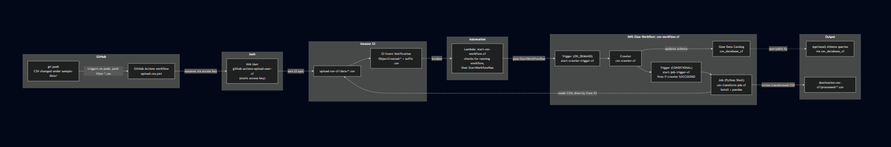

---

## Part 1 — Theory: what is CloudFormation, actually?

*Concepts:*

- **Template**: a YAML (or JSON) text file that *declares* what AWS resources
  you want (buckets, roles, Glue jobs, etc.) and their configuration. You
  describe the *end state*, not the steps to get there. This is called
  "declarative" infrastructure, as opposed to writing a script that calls
  the AWS API line by line ("imperative").
- **Stack**: when you hand a template to CloudFormation, it creates a
  **stack** which is a single, trackable unit that groups all the resources the
  template defines. Delete the stack, and (by default) every resource it
  created is deleted too. This is the single biggest reason to use
  CloudFormation: no orphaned resources, no manual cleanup.
- **Resources**: each block under `Resources:` in the template maps to one
  real AWS object (`AWS::S3::Bucket`, `AWS::Glue::Job`, etc.). CloudFormation
  figures out the order to create them in based on references between them.
- **Parameters**: the "inputs" of the template (e.g. bucket names). Instead
  of hardcoding a name inside the template, you expose it as a parameter so
  the same template can be reused with different values.
- **Intrinsic functions**: helpers like `!Ref`, `!Sub`, `!GetAtt` that let
  resources refer to each other's values. `!Ref MyBucket` gets the bucket's
  name; `!GetAtt MyRole.Arn` gets a specific attribute (the role's ARN);
  `!Sub` lets you build a string with a variable embedded in it, like a
  full S3 path.
- **Outputs**: values CloudFormation prints out once the stack finishes,
  useful for grabbing generated names/ARNs without hunting through consoles.
- **Drift**: if someone manually edits a resource CloudFormation created
  (e.g. changes a bucket setting by hand in the console), the stack's
  tracked state and reality diverge — this is called "drift." Best practice
  is to only change stack-managed resources by updating the template.

### Automating it: upload a CSV, the whole pipeline runs

By default a Glue Workflow only starts when something explicitly starts it
(console button or `aws glue start-workflow-run`). To make the pipeline
truly event-driven — upload a file, everything else happens on its own —
this template wires up:

```
S3 PutObject event               (new .csv under upload-csv-cf/data/)
        │
        ▼
S3 Notification Configuration    (filters to prefix "data/", suffix ".csv")
        │
        ▼
Lambda: start-csv-workflow-cf    (checks nothing's already running, then
        │                        calls glue:StartWorkflowRun)
        ▼
csv-workflow-cf                  (crawler -> job)
```

Two AWS concepts make this work:
- **S3 Event Notifications**: an S3 bucket can be configured to call a
  Lambda function, SQS queue, or SNS topic whenever objects are
  created/deleted/etc. Here it's scoped with a `Filter` so it only fires
  for objects under the `data/` prefix ending in `.csv` — uploads
  elsewhere in the bucket (like the `scripts/` or `temp/` prefixes) don't
  trigger it.
- **Resource-based permissions**: Lambda functions reject invocations from
  anything not explicitly allowed to call them. `AllowS3InvokeLambdaCF`
  (an `AWS::Lambda::Permission`) is what grants the S3 service permission
  to invoke this specific function — this is separate from the Lambda's
  *execution* role (which controls what the function itself is allowed to
  do once it's running).

The Lambda's own IAM role is scoped narrowly: it can only call
`glue:StartWorkflowRun` / `glue:GetWorkflowRuns` on this one workflow, and
write its own CloudWatch logs — nothing more.

### Automating it further: push a CSV to GitHub, the pipeline runs

The S3 → Lambda → Glue chain above still requires *something* to put the
CSV into S3. This project adds one more layer so that source is GitHub
itself:

```
git push (CSV under sample-data/ changed)
        │
        ▼
GitHub Actions workflow (.github/workflows/upload-csv.yml)
        │  authenticates via OIDC - no AWS keys stored in GitHub
        ▼
aws s3 sync sample-data/ → s3://upload-csv-cf/data/
        │
        ▼
(same S3 notification → Lambda → Glue chain)
```

Nothing about the S3/Lambda/Glue side changes — GitHub Actions' only job is
to become "the thing that uploads the file," using the same trigger path.

#### Authenticating GitHub Actions to AWS: IAM user + access key

This project authenticates GitHub Actions using a **static IAM user access
key** — simpler to set up than OIDC federation, at the cost of the key
being long-lived (it doesn't expire on its own; you rotate it yourself).
The user's permissions are scoped as tightly as the task needs: it can only
`s3:PutObject` into `upload-csv-cf/data/*` and `s3:ListBucket` on that one
bucket — nothing else, in case the key is ever exposed.

#### Setup: Step 1 — deploy the IAM user stack

```bash
aws cloudformation create-stack \
  --stack-name github-iam-user-cf \
  --template-body file://github-iam-user.yaml \
  --capabilities CAPABILITY_NAMED_IAM

aws cloudformation wait stack-create-complete --stack-name github-iam-user-cf
```

#### Setup: Step 2 — generate an access key via CLI

Deliberately done via CLI rather than in the CloudFormation template
itself. This way the secret key is only ever printed on the terminal
once and it is not stored anywhere in CloudFormation's stack outputs or event
history.

```bash
aws iam create-access-key --user-name github-actions-upload-user-cf
```

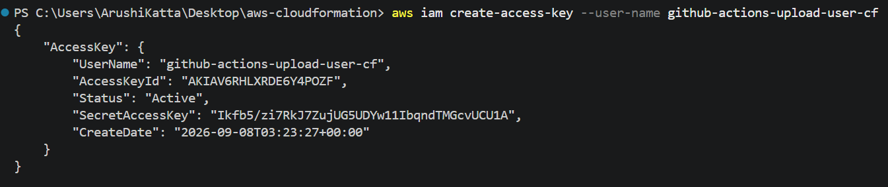

This prints a JSON block containing `AccessKeyId` and `SecretAccessKey`.
**Copy both immediately** — the secret key is shown only this one time; if
you lose it, delete that key (`aws iam delete-access-key`) and generate a
new one.

#### Setup: Step 3 — add GitHub repo secrets

In your repo: **Settings → Secrets and variables → Actions → New repository
secret**, add three:
- `AWS_ACCESS_KEY_ID` — the `AccessKeyId` from Step 2
- `AWS_SECRET_ACCESS_KEY` — the `SecretAccessKey` from Step 2
- `AWS_REGION` — the region your stack is deployed in, e.g. `us-east-1`

#### Setup: Step 4 — push and watch it run

```bash
git add sample-data/sample.csv
git commit -m "Trigger pipeline via GitHub Actions"
git push origin main
```
The workflow only fires on pushes that touch a `.csv` under `sample-data/`
(see the `paths` filter in `upload-csv.yml`) — editing the README or
templates won't trigger it.

Watch it in the **Actions** tab of your repo

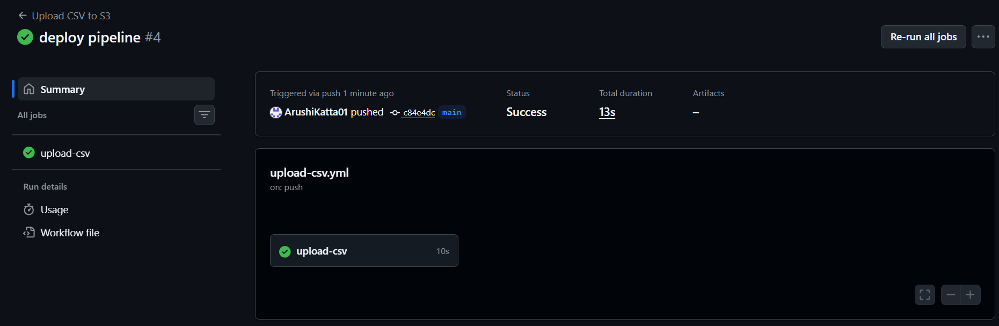

Once the Action completes, the same S3 → Lambda → Glue chain you already
verified takes over:
```bash
aws logs tail /aws/lambda/start-csv-workflow-cf --since 5m --follow
aws glue get-workflow-runs --name csv-workflow-cf --max-results 1
```

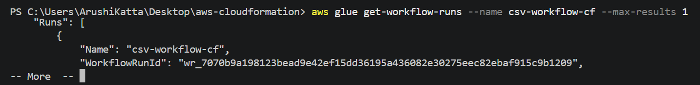

#### Note: Key rotation

Since this key never expires automatically, put a reminder somewhere (a
calendar note is fine) to rotate it periodically:
```bash
# create a new key, update the GitHub secrets with it, THEN deactivate/delete the old one
aws iam create-access-key --user-name github-actions-upload-user-cf
aws iam update-access-key --user-name github-actions-upload-user-cf --access-key-id <OLD_KEY_ID> --status Inactive
# once you've confirmed the new key works in Actions:
aws iam delete-access-key --user-name github-actions-upload-user-cf --access-key-id <OLD_KEY_ID>
```

### Why a Glue *Workflow* specifically?

A single Glue Job can't (on its own) know "wait until the table schema is
up to date before running." A **Workflow** is Glue's orchestration layer: it
strings together **Triggers**, **Crawlers**, and **Jobs** into one pipeline
with dependencies:

```
[start-crawler-trigger-cf]  (ON_DEMAND — you start it manually)
        │
        ▼
[csv-crawler-cf]  (scans upload-csv-cf/data/, updates the Glue Catalog table)
        │
        ▼ (only if crawler SUCCEEDED)
[start-job-trigger-cf]  (CONDITIONAL trigger)
        │
        ▼
[csv-transform-job-cf]  (reads the table, transforms, writes to destination-csv-cf)
```

This mirrors exactly what you'd have built by hand in the console, just
captured as code.

---

## Part 2 — Prerequisites

1. An AWS account with permissions to create S3 buckets, IAM roles, and Glue
   resources.
2. [AWS CLI installed and configured](https://docs.aws.amazon.com/cli/latest/userguide/getting-started-install.html)
   (`aws configure`, using an IAM user/role with sufficient permissions) —
   only needed if you deploy via CLI rather than the console.
3. Git, and a new empty GitHub repository to push this project into.

---

## Part 3 — Step-by-step deployment

### Step 1: Create your GitHub repo and add these files

```bash
git init glue-workflow-cf
cd glue-workflow-cf
# copy in template.yaml, glue-scripts/, sample-data/, README.md
git add .
git commit -m "Initial commit: Glue CSV workflow via CloudFormation"
git branch -M main
git remote add origin https://github.com/<your-username>/glue-workflow-cf.git
git push -u origin main
```

*Why this matters:* keeping the template in version control means every
change to your infrastructure is tracked, reviewable, and revertible — the
same discipline you'd apply to application code ("Infrastructure as Code").

### Step 2: Deploy the CloudFormation stack

**Option A — AWS Console (easiest for a first run):**
1. Go to the **CloudFormation** console → **Create stack** → **With new
   resources (standard)**.
2. Choose **Upload a template file**, select `template.yaml`.
3. Give the stack a name, e.g. `glue-csv-workflow-cf`.
4. On the Parameters screen you'll see `UploadBucketName`,
   `DestinationBucketName`, etc. pre-filled with the defaults
   (`upload-csv-cf`, `destination-csv-cf`) — leave them, or change if those
   bucket names are already taken globally.
5. Click through **Next** → **Next**, check the box acknowledging
   CloudFormation may create IAM resources (it needs to, for the Glue
   role), then **Submit**.
6. Watch the **Events** tab — it lists every resource as it's created.
   Wait for stack status `CREATE_COMPLETE`.

**Option B — AWS CLI:**
```bash
aws cloudformation create-stack \
  --stack-name glue-csv-workflow-cf \
  --template-body file://template.yaml \
  --capabilities CAPABILITY_NAMED_IAM

# poll until it finishes:
aws cloudformation wait stack-create-complete --stack-name glue-csv-workflow-cf
```
`--capabilities CAPABILITY_NAMED_IAM` is required because the template
creates an IAM role with an explicit name (`glue-service-role-cf`) —
CloudFormation requires this explicit acknowledgment as a safety check
before it's allowed to create IAM resources.

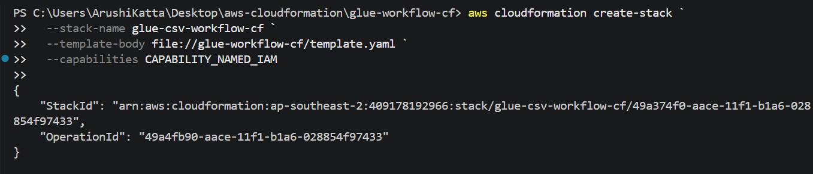

You can spot-check that the Job resource picked up the right arguments:

```bash
aws glue get-job --job-name csv-transform-job-cf --query "Job.DefaultArguments"
```

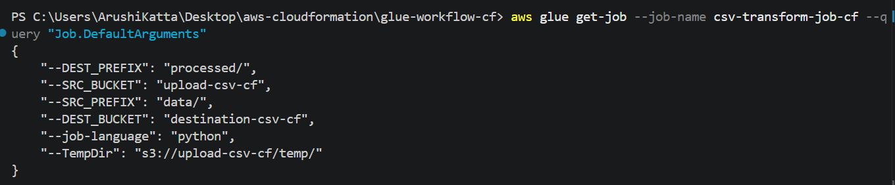

### Step 3: Upload the Glue script to the newly-created upload bucket

The Job resource pointed at `s3://upload-csv-cf/scripts/csv_transform_job.py`
before that file existed — CloudFormation doesn't check the file is there at
deploy time, only Glue checks it when the job actually *runs*. So now that
the bucket exists, upload the script:

```bash
aws s3 cp glue-scripts/csv_transform_job.py s3://upload-csv-cf/scripts/csv_transform_job.py
```

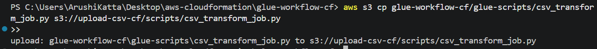

### Step 4: Upload sample data

The crawler is configured to scan `s3://upload-csv-cf/data/`:

```bash
aws s3 cp sample-data/sample.csv s3://upload-csv-cf/data/sample.csv
```

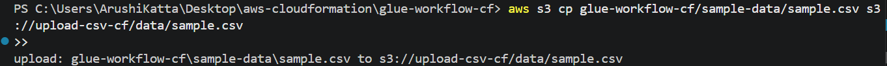

### Step 5: Run the workflow

**If you're deploying this for the first time**, or already have the stack
running, do this once to pick up the automation:

```bash
aws cloudformation update-stack \
  --stack-name glue-csv-workflow-cf \
  --template-body file://template.yaml \
  --capabilities CAPABILITY_NAMED_IAM

aws cloudformation wait stack-update-complete --stack-name glue-csv-workflow-cf
```

From here on, **you don't need to manually start anything** — uploading a
CSV under `data/` is enough:
```bash
aws s3 cp sample-data/sample.csv s3://upload-csv-cf/data/sample2.csv
```
Within a few seconds, S3 invokes the Lambda, which starts the workflow. You
can watch it happen:
```bash
aws glue get-workflow-runs --name csv-workflow-cf --max-results 1
```

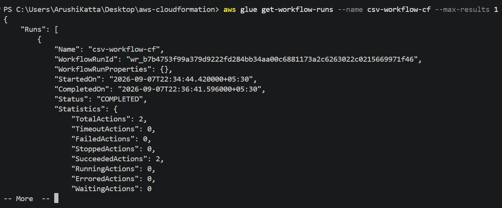

Or watch it in the console — every step in the graph turns green as it
completes:

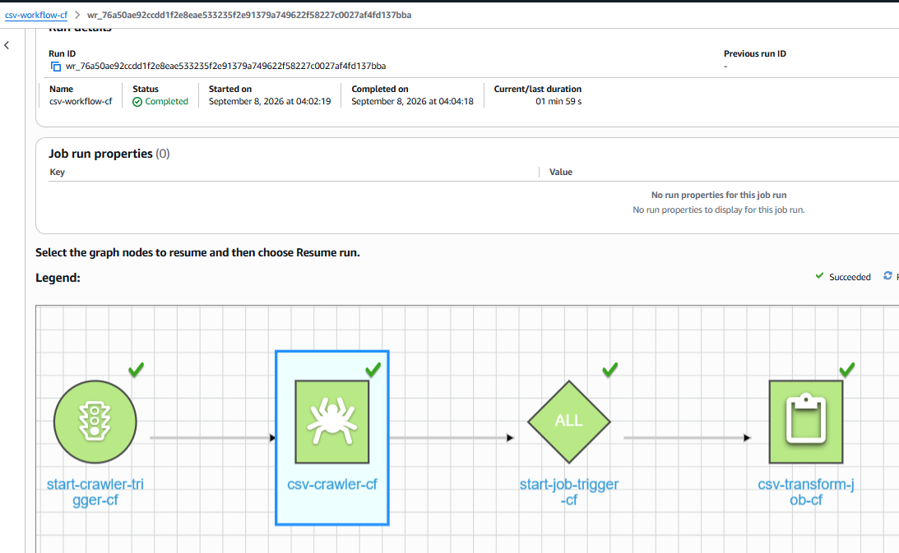

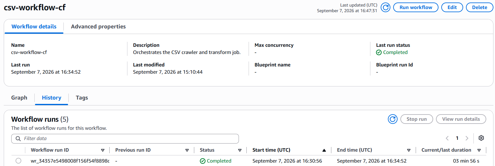

or check the Lambda's own logs to confirm it fired:
```bash
aws logs tail /aws/lambda/start-csv-workflow-cf --since 5m --follow
```

**Manual start still works too** (useful for testing without uploading a
new file):
- **Console:** Go to **AWS Glue** → **Workflows** → select `csv-workflow-cf` →
  **Run**.
- **CLI:**
```bash
aws glue start-workflow-run --name csv-workflow-cf
```

### Step 6: Verify the output

```bash
aws s3 ls s3://destination-csv-cf/processed/
```
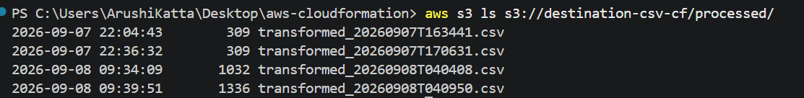

In the console, the job's run history should show `Succeeded`:

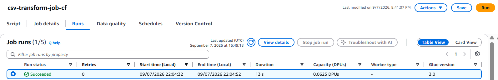

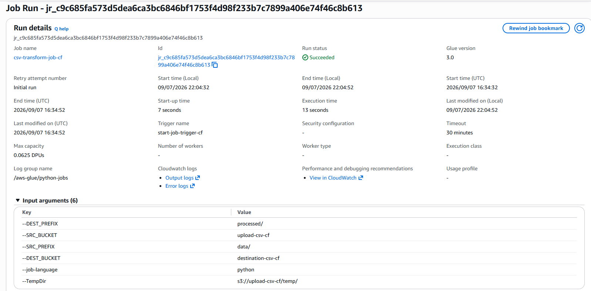

The job's CloudWatch log group (`/aws-glue/python-jobs/output`) shows the
script's own `print()` output, confirming exactly what it read and wrote:

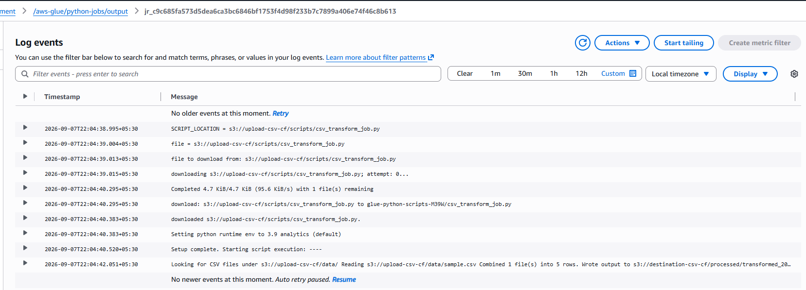

### Step 7: Tear it down (avoid ongoing charges)

Empty both buckets first — CloudFormation cannot delete a non-empty S3
bucket:
```bash
aws s3 rm s3://upload-csv-cf --recursive
aws s3 rm s3://destination-csv-cf --recursive

aws cloudformation delete-stack --stack-name glue-csv-workflow-cf
aws cloudformation wait stack-delete-complete --stack-name glue-csv-workflow-cf
```
---
This is the payoff of using CloudFormation: one command removes every
resource the project created — buckets, IAM role, Glue database, crawler,
job, workflow, and triggers.